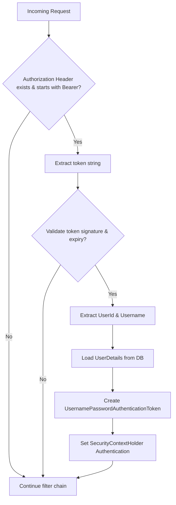

# 🔐 Security Infrastructure Documentation (Deep Dive)

This document provides a detailed explanation of the authentication mechanisms, encryption algorithms, authorization rules, and CORS configuration implemented within the Hostel Mess application.

---

## 🛡️ Spring Security Filter Chain (`SecurityConfig.java`)

End-to-end security configurations are defined using standard Spring Security constructs.

### Method Signature:
```java
@Configuration
@EnableMethodSecurity
public class SecurityConfig {
    // Component declarations...
    
    @Bean
    public SecurityFilterChain filterChain(HttpSecurity http) throws Exception {
        http
            .csrf(csrf -> csrf.disable()) // Stateless APIs do not use CSRF cookies
            .cors(Customizer.withDefaults()) // Hooks CORS configuration bean
            .sessionManagement(sm -> sm.sessionCreationPolicy(SessionCreationPolicy.STATELESS))
            .authorizeHttpRequests(auth -> auth
                .requestMatchers("/api/auth/**", "/", "/index.html", "/static/**", "/public/**", "/uploads/**").permitAll()
                .requestMatchers("/api/groups/**").authenticated()
                .requestMatchers("/api/meals/update").authenticated()
                .requestMatchers("/api/complaints/vote").authenticated()
                .requestMatchers("/api/users/me").authenticated()
                .requestMatchers("/api/chat/**").authenticated()
                .anyRequest().permitAll()
            )
            .addFilterBefore(
                jwtAuthenticationFilter(jwtTokenProvider(), customUserDetailsService()), 
                UsernamePasswordAuthenticationFilter.class
            );
        return http.build();
    }
}
```

---

## 🔑 Custom JWT Filter (`JwtAuthenticationFilter.java`)

The `JwtAuthenticationFilter` extends Spring's `OncePerRequestFilter` to intercept all requests.



### Authentication Execution Detail:
1. Extract the `Authorization` header.
2. Verify it starts with `Bearer `.
3. Extract the token string: `token = header.substring(7)`.
4. Validate the signature against the secret key: `jwtTokenProvider.validateToken(token)`.
5. Retrieve the user identifier: `userId = jwtTokenProvider.getUserIdFromToken(token)`.
6. Load details: `userDetails = customUserDetailsService.loadUserByUsername(userId)`.
7. Bind the authentication object to the context:
   ```java
   UsernamePasswordAuthenticationToken authentication = 
       new UsernamePasswordAuthenticationToken(userDetails, null, userDetails.getAuthorities());
   authentication.setDetails(new WebAuthenticationDetailsSource().buildDetails(request));
   SecurityContextHolder.getContext().setAuthentication(authentication);
   ```

---

## 🔏 JWT Token Signature & Fields (`JwtTokenProvider.java`)

Tokens are signed using HMAC-SHA256 (`SignatureAlgorithm.HS256`) and compiled using a secret key configuration.

### Token Claims Structure:
- **`sub` (Subject)**: Stores the user's unique MongoDB hex `userId`.
- **`username`**: Stores the user's primary email address (e.g. `student@hostel.app`).
- **`role`**: Indicates access level (`STUDENT` or `ADMIN`).
- **`iat` (Issued At)**: Timestamp of generation.
- **`exp` (Expiration)**: Defaults to 24 hours after creation (`86400000` milliseconds).

### Parsing Tokens:
```java
private Claims parseClaims(String token) {
    return Jwts.parser()
        .setSigningKey(key) // Byte array computed from jwtSecret
        .parseClaimsJws(token)
        .getBody();
}
```

---

## 🔒 Password Hashing (BCrypt)

Password encryption uses **BCrypt**, a slow hashing function that incorporates a salt to prevent rainbow table attacks.
- Bean declaration:
  ```java
  @Bean
  public PasswordEncoder passwordEncoder() {
      return new BCryptPasswordEncoder();
  }
  ```
- Usage during registration:
  ```java
  String hashed = passwordEncoder.encode(request.getPassword());
  ```
- Validation during login:
  ```java
  if (!passwordEncoder.matches(request.getPassword(), user.getPassword())) {
      throw new RuntimeException("Invalid credentials");
  }
  ```

---

## 🌐 CORS Setup (`CorsConfig.java`)

Cross-Origin Resource Sharing is configured to support requests from the frontend app:
- Loads the allowed frontend address from the environment variable `${frontend.url:http://localhost:3000}`.
- Allows credential transfers (cookies, headers).
- Defines allowed request methods: `GET`, `POST`, `PUT`, `DELETE`, `OPTIONS`.
- Sets allowed headers: `Authorization`, `Content-Type`, `Cache-Control`.
